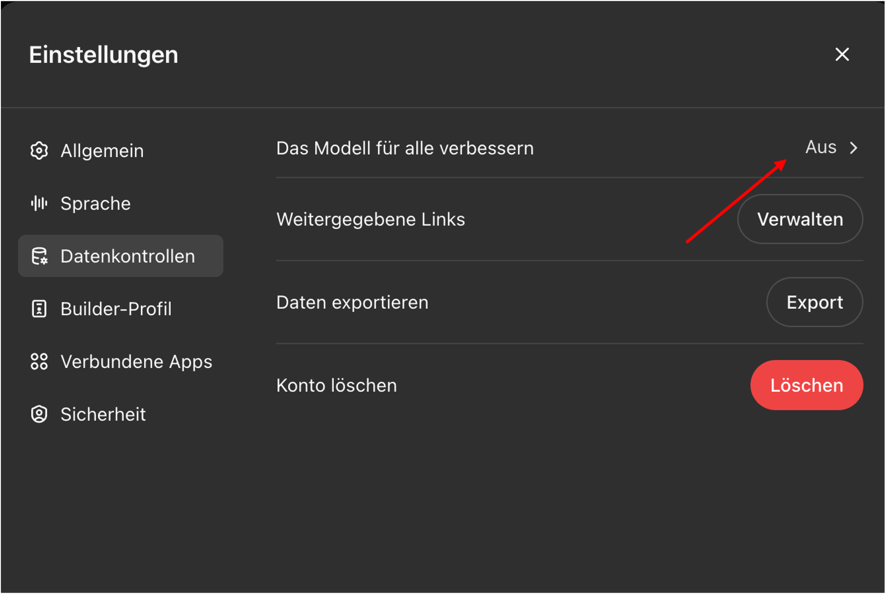
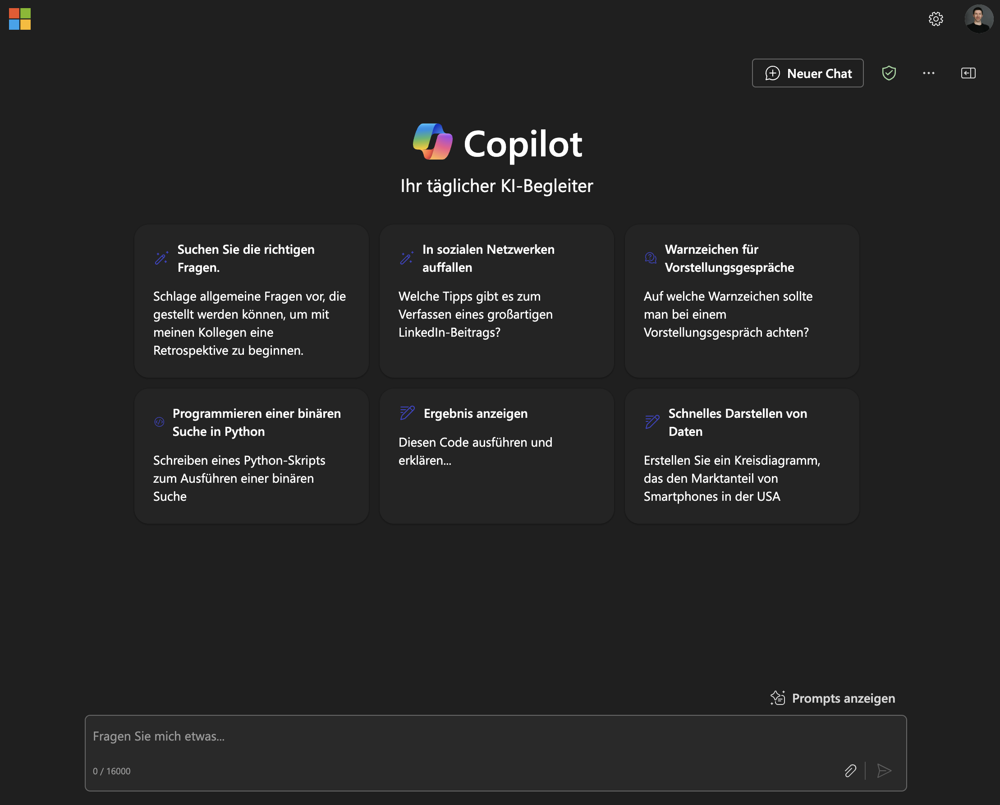

## KI-Policy BFH

Die BFH hat eine KI-Policy verabschiedet:

- Verabschiedet am 7. Mai 2025
- Gilt für alle Bereiche: Lehre, Forschung, Hochschulbetrieb

## Die fünf Grundsätze

1. Transparenz und Nachvollziehbarkeit
2. Informationssicherheit und Datenschutz
3. Ethische Reflexion und Verantwortlichkeit
4. Wissenschaftliche Integrität
5. Didaktische Angemessenheit und Chancengleichheit

## Deine Verantwortung als Lehrperson

- Auswahl und Einsatz von KI-Tools verantworten
- Eignung für Lernziele prüfen
- Studierende transparent informieren
- Festlegen, wie KI-Inhalte zu kennzeichnen sind
- Vorgaben auf Departements-/Studiengangsebene beachten

## Studierende

Was von Studierenden erwartet wird:

- Reflektierter Einsatz im vorgegebenen Rahmen
- Auseinandersetzung mit Potenzialen und Grenzen
- Feedback an Lehrende geben

## Rechtliche Aspekte

Zwei wichtige Aspekte bei der Benutzung von LLMs:

 

:::: {.columns}
::: {.column width="50%"}
**Rechtliche Aspekte **

- Wer besitzt die Rechte an den von LLMs generierten Inhalten?
- Risiko von Plagiaten und Urheberrechtsverletzungen
- Richtlinien für den Umgang mit generierten Inhalten

:::
::: {.column width="50%"}
**Datenschutz **

- Schutz personenbezogener Daten
- Einhaltung von Datenschutzbestimmungen
:::
::::

## Rechtliche Aspekte

- KI-Modelle können mit Inhalten trainiert sein, an denen Dritte Urheberrechte haben.

- Der Input (Prompt) kann geschützte Inhalte Dritter enthalten.

- Der von der KI generierte Output kann zufällig geschützte Inhalte Dritter enthalten.

## Empfehlung: Deklaration

KI-Policy: Geben Sie deutlich an, dass der Inhalt von einer KI erstellt wurde:

:::{.callout-tip title="Deklaration"}
Der/die Autor\*in hat diesen Text teilweise mit `[Modell]` erstellt. Nach der Erstellung des Entwurfs hat der/die Autor\*in den Text überprüft, bearbeitet und nach eigenem Ermessen angepasst und übernimmt die volle Verantwortung für den Inhalt dieser Veröffentlichung.
:::

Zitieren Sie das verwendete Modell in ähnlicher Weise, wie Sie Software zitieren würden.

## Datenschutz {.smaller}

Datenschutz allgemein bedeutet:

- sicherzustellen, dass keine persönlichen Daten der Lehrenden oder Lernenden ohne deren Zustimmung gesammelt, gespeichert oder weiterverarbeitet werden
- Transparenz darüber, welche Daten erhoben und wie sie verwendet werden
- sicherzustellen, dass Daten nicht für andere Zwecke als die ursprünglich angegebenen verwendet werden
- Einhaltung von Datenschutzgesetzen und -vorschriften

:::{.callout-caution appearance="minimal"}
Lehrpersonen müssen Datenschutz beim Einsatz von (digitalen) Tools immer beachten.
:::

## Schutzmassnahmen

:::: {.columns}
::: {.column width="50%"}
- Keine persönlichen Daten in die Eingabe von ChatGPT einfliessen lassen (nur anonymisierte Informationen)

- Keine Eingabe von sensiblen oder vertraulichen Informationen

:::

::: {.column width="50%"}
Einstellungen im Konto für Datenkontrolle:

{width=80%}
:::
::::

## Copilot verwenden

:::: {.columns}
::: {.column width="50%"}
[Microsoft Copilot](https://copilot.microsoft.com/) garantiert BFH-Mitarbeitenden, dass Benutzerdaten gesichert sind:

 [Schutz von Unternehmensdaten](https://learn.microsoft.com/de-ch/copilot/microsoft-365/enterprise-data-protection)

- Benutzerdaten sind durch Verschlüsselung, Sicherheitskontrollen und Datenisolation geschützt.
- Microsoft verwendet Daten nicht ohne Anweisung des Benutzers.

:::
::: {.column width="50%"}

:::
::::

## Freigegebene Tools

Wo findest du die Liste?

- mybfh > IT-Applikationen > Abgeklärte KI-Tools
- mybfh > IT-Applikationen > Neue KI-Tools

## Die wichtigsten Tools

| Tool | Zugang | Stärken |
|------|--------|---------|
| Microsoft Copilot | BFH-Lizenz | Integration in Office, Datenschutz |
| ChatGPT | Persönlich/Abo | Vielseitig, viele Funktionen |
| Claude | Persönlich/Abo | Lange Texte, Reasoning |

## Welches Tool wofür?

- **Kurze Fragen, Office-Integration**: Copilot
- **Komplexe Aufgaben, Coding**: ChatGPT
- **Lange Dokumente, Analyse**: Claude

## Support

Bei Fragen:

- **CISO**: Informationssicherheit
- **Fachstelle Datenschutz**: Datenschutzfragen
- **Virtuelle Akademie**: Didaktische Beratung
- **Bildung 6.0 Plattform**: Ressourcen und Austausch

## Ressourcen

- [KI-Policy BFH (PDF)](../../assets/pdfs/KI-Policy_BFH_FHL7Mai25_verabschiedet-1.pdf)
- [Bildung 6.0](https://bildung6.bfh.ch)
- mybfh > IT-Applikationen > KI-Tools
