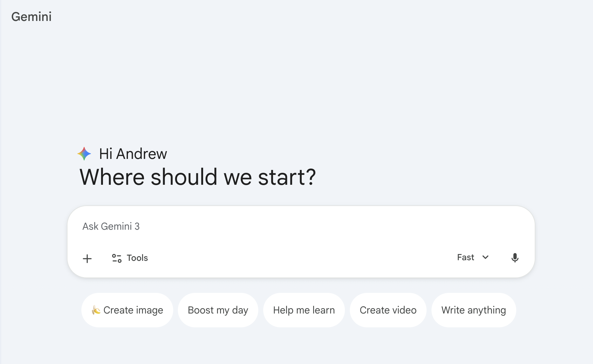
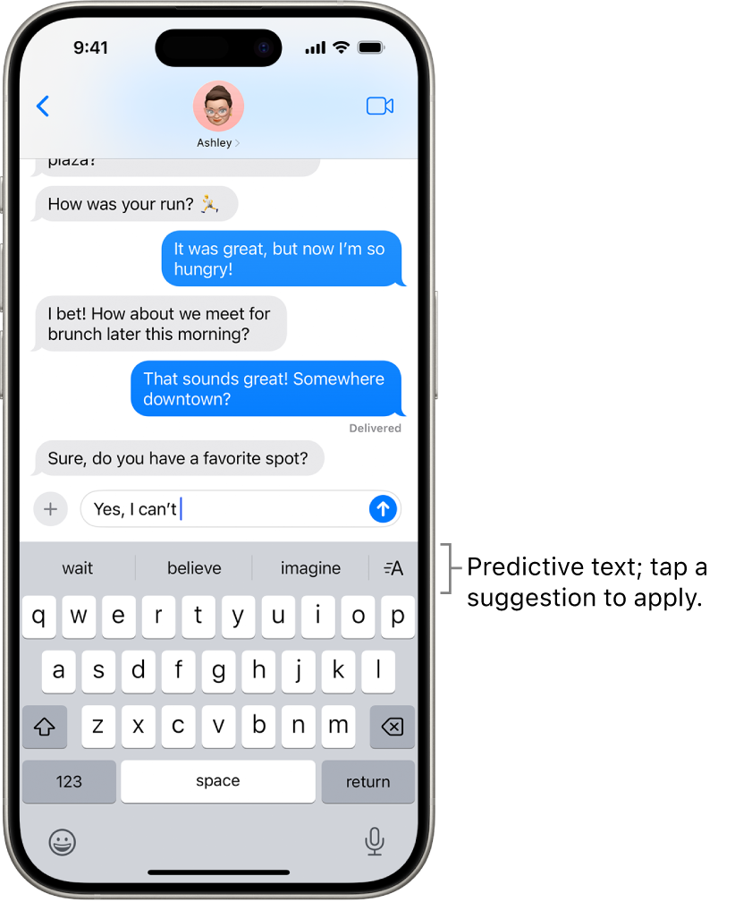
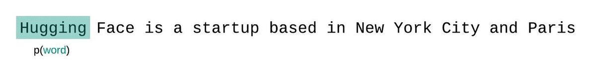
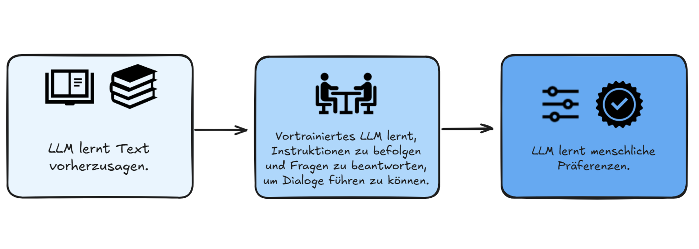

## Was sind Chatbots?

:::: {.columns}
::: {.column width="50%"}

:::

::: {.column width="50%"}

:::
::::

:::: {.columns}
::: {.column width="50%"}
[[Claude](https://claude.ai){target="_blank"} (Anthropic)]{style="font-size: 0.6em;"}
:::

::: {.column width="50%"}
[[Gemini](https://gemini.google.com/){target="_blank"} (Google)]{style="font-size: 0.6em;"}
:::
::::

## Was sind LLMs?

:::: {.columns}
::: {.column width="60%"}
Ein LLM kann man sich wie einen ausgefeilten Autocomplete-Mechanismus vorstellen.
:::
::: {.column width="40%"}

:::
::::

## Die Kernidee

Sprachmodelle sagen das **nächste Wort** vorher.

::: {.hidden}
$$
\newcommand{\green}[1]{\color{green}{#1}}
\newcommand{\purple}[1]{\color{purple}{#1}}
\newcommand{\red}[1]{\color{red}{#1}}
\newcommand{\blue}[1]{\color{blue}{#1}}
$$
:::

$$\green{P(\text{Wort}_{i+1}} \mid \red{\text{Kontext}}, \blue{\text{Modell}})$$

Jede Vorhersage basiert auf dem **Kontext** und dem internen **Modell**.

## Token-Vorhersage

```{ojs}
//| echo: false

tokenDatabase = ({
  "Der Hund liegt auf dem": [
    {token: "Boden", prob: 0.32},
    {token: "Sofa", prob: 0.24},
    {token: "Bett", prob: 0.18},
    {token: "Teppich", prob: 0.14},
    {token: "Rasen", prob: 0.12}
  ],
  "Die Katze sitzt auf dem": [
    {token: "Dach", prob: 0.28},
    {token: "Baum", prob: 0.24},
    {token: "Sofa", prob: 0.20},
    {token: "Tisch", prob: 0.16},
    {token: "Fensterbrett", prob: 0.12}
  ],
  "Die Studierenden lernen für die": [
    {token: "Prüfung", prob: 0.45},
    {token: "Klausur", prob: 0.25},
    {token: "Zukunft", prob: 0.12},
    {token: "Vorlesung", prob: 0.10},
    {token: "Karriere", prob: 0.08}
  ]
})

viewof selectedSentence = Inputs.select(Object.keys(tokenDatabase), {
  label: "Satzanfang:",
  value: "Der Hund liegt auf dem"
})

currentProbs = tokenDatabase[selectedSentence]
```

**Kontext:** ${selectedSentence} ___

```{ojs}
//| echo: false

Plot.plot({
  marginLeft: 100,
  width: 500,
  height: 180,
  x: {domain: [0, 0.5], label: "Wahrscheinlichkeit", tickFormat: d => (d * 100) + "%"},
  y: {label: null},
  marks: [
    Plot.barX(currentProbs, {y: "token", x: "prob", fill: "#A3195B", sort: {y: "-x"}}),
    Plot.text(currentProbs, {y: "token", x: "prob", text: d => (d.prob * 100).toFixed(0) + "%", dx: 5, textAnchor: "start"})
  ]
})
```

## Temperatur

**Kontext:** ${selectedSentence} ___

```{ojs}
//| echo: false

viewof temperature = Inputs.range([0.1, 2.0], {
  value: 1.0,
  step: 0.1,
  label: "Temperature"
})

scaledProbs = {
  const t = temperature;
  const logits = currentProbs.map(p => Math.log(p.prob));
  const scaled = logits.map(l => Math.exp(l / t));
  const sum = scaled.reduce((a, b) => a + b, 0);
  return currentProbs.map((p, i) => ({token: p.token, prob: scaled[i] / sum}));
}

tempDescription = temperature < 0.5 ? "Deterministisch: Fast immer das wahrscheinlichste Wort" :
  temperature < 1.0 ? "Ausgeglichen: Gute Mischung" :
  temperature < 1.5 ? "Kreativ: Mehr Variation" : "Unvorhersehbar: Auch unwahrscheinliche Wörter werden gewählt"
```

**Temperature = ${temperature.toFixed(1)}**: ${tempDescription}

```{ojs}
//| echo: false

Plot.plot({
  marginLeft: 100,
  width: 500,
  height: 180,
  x: {domain: [0, 1], label: "Angepasste Wahrscheinlichkeit", tickFormat: d => (d * 100) + "%"},
  y: {label: null},
  marks: [
    Plot.barX(scaledProbs, {y: "token", x: "prob", fill: "#D4A03E", sort: {y: "-x"}}),
    Plot.text(scaledProbs, {y: "token", x: "prob", text: d => (d.prob * 100).toFixed(0) + "%", dx: 5, textAnchor: "start"})
  ]
})
```

## Vorhersage in Aktion

Nicht alle Teile des Kontexts sind gleich wichtig:

<br>

:::{.r-fit-text}
_"Die Familie, die sehr wohlhabend war, lebte in einem grossen Haus. Das Haus stand inmitten eines weitläufigen Gartens. Es war bekannt für seine prächtige Fassade und die grosszügigen ___"_
:::

<br>

Welche Wörter sind besonders wichtig für die Vorhersage?

## Wie generieren LLMs Text?

<br>

$$\green{P(\text{Wort}_{i+1}} \mid \red{\text{Kontext}}, \blue{\text{Modell}})$$



## Wie werden LLMs trainiert?



## Wichtige Einsicht

::: {.key-point}
## Mustervervollständigung

Das klingt simpel, aber es ist nicht so anders von dem, was unser Gehirn tut.

Auch wir vervollständigen Muster auf Basis von Erfahrung, nicht durch direkten Zugriff auf Fakten. Der Unterschied liegt im Grad der Zuverlässigkeit.
:::

## Chain-of-Thought "Denken"

Explizites Nachdenken verbessert die Ergebnisse:

- "Denke Schritt für Schritt"
- Der Chatbot zeigt seinen "Denkprozess"
- Besonders hilfreich bei komplexen Aufgaben

## Beispiel: 9.11 vs 9.8

**Frage**: "Was ist grösser: 9.11 oder 9.8?"

<br>

**Ohne Anleitung**: Oft falsch (verwechselt mit Datumsformat)

**Mit "Denke Schritt für Schritt"**: Meist richtig

<br>

::: {.fragment}
Warum? Mehr Tokens = mehr "Rechenzeit" für die statistische Vorhersage
:::

## Live-Demonstration

::: {.demonstration}
## Vergleich: Direkt vs. Schritt für Schritt


1. **Direkt**: "Was ist grösser: 9.11 oder 9.8?"
2. **Mit Anleitung**: "Denke Schritt für Schritt. Was ist grösser: 9.11 oder 9.8?"
:::

## Warum funktioniert "Denken"?

::: {.key-point}
## Mehr Kontext, bessere Vorhersagen

"Denken" verbessert die Ergebnisse, weil mehr Kontext (die Zwischenschritte) zur Verfügung steht.

Die Implementierung unterscheidet sich von menschlichem Denken, aber die Funktion ist ähnlich: Schritt für Schritt zum Ziel.
:::

## Zusammenfassung: Was ist KI?

| Aspekt | Realität |
|--------|----------|
| Textgenerierung | Vorhersage des nächsten Worts basierend auf Mustern |
| Verarbeitung | Mustervervollständigung (ähnlich wie unser Gehirn) |
| "Denken" | Mehr Kontext = bessere Vorhersagen |
| Wissen | Muster aus Trainingsdaten, weniger zuverlässig als Fakten |

## Takeaway

::: {.key-point}
## Antwort auf Frage 1

**Was ist KI?**

Sprachmodelle generieren Text durch Vorhersage des nächsten Worts. Das ist funktional ähnlich wie unser Gehirn Muster vervollständigt. Der Unterschied liegt im Grad der Zuverlässigkeit: Der Kontext bestimmt das Ergebnis.
:::
