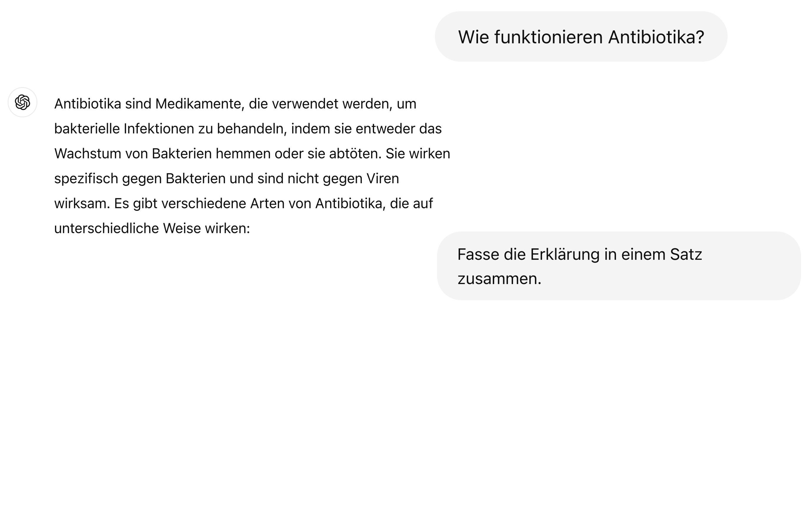
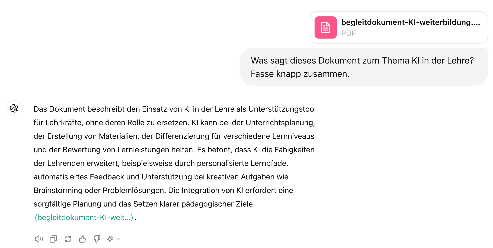
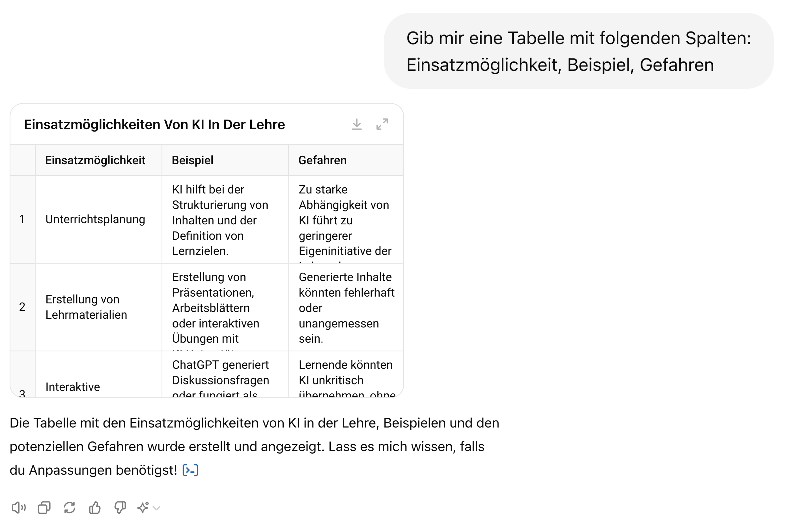
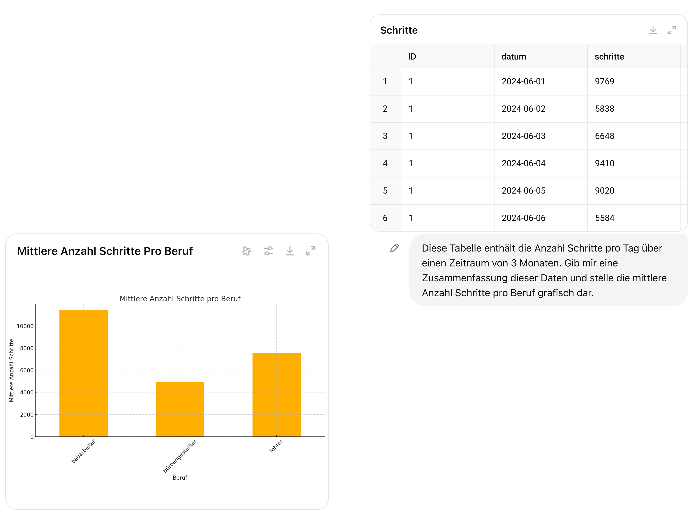
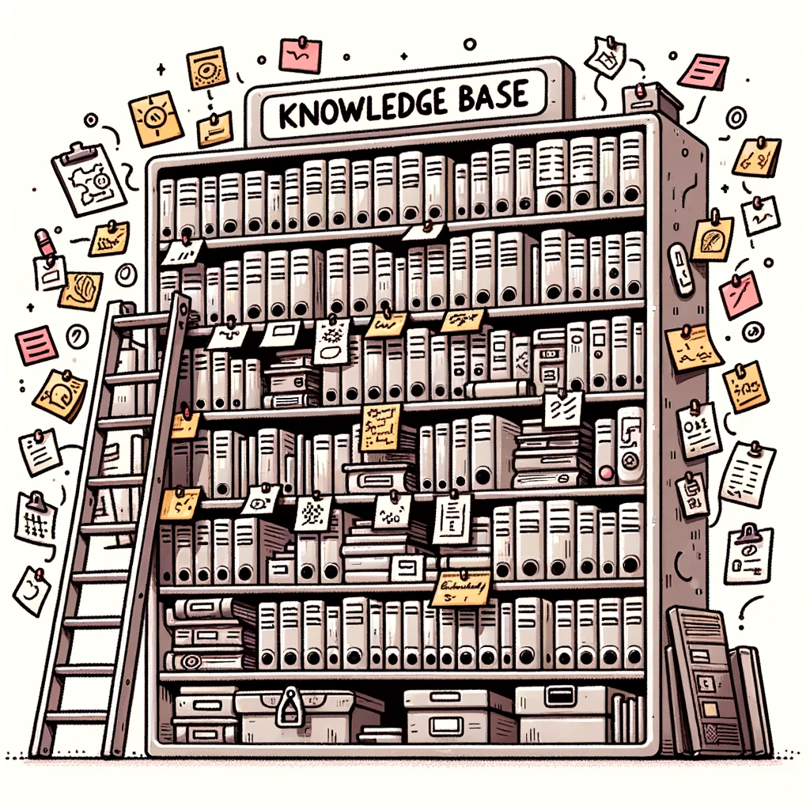
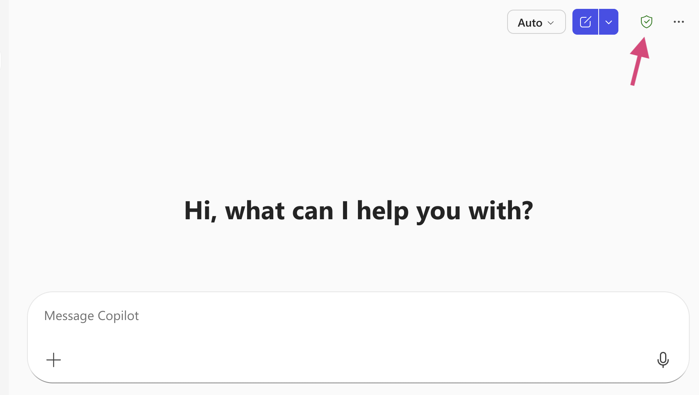

## Mehr als Textgenerierung {.smaller}

Moderne Chatbots sind **keine reinen Textgeneratoren** mehr.

::: {.columns}
::: {.column width="40%"}
Sie können:

- Im Internet suchen
- Dateien analysieren (PDFs, Bilder)
- Code ausführen
- Mit externen Diensten interagieren
:::
::: {.column width="60%"}

:::
::::

## Fragen beantworten

## Bilder analysieren

## Dokumente zusammenfassen

## Output strukturieren

## Websuche

## Datenanalyse

## Custom GPTs

## Aber: Grenzen und Gefahren

:::: {.columns}
::: {.column width="50%"}
:::{.r-fit-text}
- **Urheberrecht**: Trainiert mit möglicherweise geschützten Texten
- **Bias**: Vorurteile aus Trainingsdaten
- **Energieverbrauch**: Hoher Ressourcenverbrauch
- **Sycophancy**: Neigung, Nutzer zu bestätigen
:::

:::
::: {.column width="50%"}

:::
::::

## Keine Wissensdatenbank

:::: {.columns}
::: {.column width="50%"}
:::{.r-fit-text}
- LLMs werden **nicht trainiert, faktisch korrekt** zu sein
- Wir müssen alle Aussagen **kritisch hinterfragen**
- LLMs sind **keine Wissensdatenbanken**
- Informationen immer anhand externer Quellen überprüfen
:::
:::
::: {.column width="50%"}

:::
::::

## KI an der BFH

Die BFH hat eine KI-Policy verabschiedet (Mai 2025):

**Die fünf Grundsätze**:

1. Transparenz und Nachvollziehbarkeit
2. Informationssicherheit und Datenschutz
3. Ethische Reflexion und Verantwortlichkeit
4. Wissenschaftliche Integrität
5. Didaktische Angemessenheit und Chancengleichheit

::: {.notes}
**KI-Policy BFH (Mai 2025)**

Die Policy gilt für alle Bereiche: Lehre, Forschung, Hochschulbetrieb.

**Die fünf Grundsätze:**

1. **Transparenz**: Offen kommunizieren
2. **Datenschutz**: BFH-Richtlinien: Neue Tools müssen geprüft werden
3. **Ethik**: Nutzer tragen Verantwortung
4. **Integrität**: Plagiate vermeiden
5. **Didaktik**: Pädagogischer Mehrwert?

**Zusätzlich**: Nachhaltigkeit (Energieeffizienz, Ressourcen) beachten.

**Wer hilft?** CISO, Fachstelle Datenschutz, Virtuelle Akademie.
:::

## Deine Verantwortung als Lehrperson

Laut KI-Policy sind **Lehrende verantwortlich** für:

- Auswahl und Einsatz von KI-Tools als Teil des Lehrkonzepts
- Prüfung der Eignung im Hinblick auf Lernziele und Kompetenzförderung
- Transparente Information der Studierenden über eingesetzte Tools
- Festlegung, wie KI-generierte Inhalte zu kennzeichnen sind

## Rechtliche Aspekte

:::: {.columns}
::: {.column width="50%"}
**Urheberrecht**

- Wer besitzt die Rechte an KI-generierten Inhalten?
- Risiko von Plagiaten
- Deklarationspflicht

:::
::: {.column width="50%"}
**Datenschutz**

- Keine persönlichen Daten eingeben
- Keine sensiblen Informationen
- Kontoeinstellungen prüfen
:::
::::

## Was darf in den Chatbot? {.smaller}
 
 **Unbedenklich** (ÖFFENTLICH/INTERN):

- Allgemeine Fragen, Unterrichtsmaterialien, Ideenentwicklung

 **Nicht eingeben** (VERTRAULICH):

- Namen von Studierenden, Prüfungsleistungen, Verträge, Personaldaten

::: {.pro-tip}
## Faustregel
Würdest du es an eine Pinnwand hängen? Dann ist es okay.
:::

 
[Vollständige Datenklassifikation auf mybfh ](https://bernerfachhochschule.sharepoint.com/sites/mybfh-IT-Applikationen-de/SitePages/Datenklassifikation.aspx){target="_blank"}

## Freigegebene Tools {.smaller}

| Tool | ÖFFENTLICH | INTERN | VERTRAULICH |
|------|:----------:|:------:|:-----------:|
| **Microsoft Copilot** (BFH) |  |  |  |
| **ChatGPT Edu** (BFH Pilot) |  |  |  |
| **ChatGPT** (persönlich)[^1] |  |  |  |
| **Lokale KI** (ohne Cloud) |  |  |  |

[^1]: "Learning" muss manuell ausgeschaltet werden!

[Alle abgeklärten Tools auf mybfh ](https://bernerfachhochschule.sharepoint.com/sites/mybfh-IT-Applikationen-de/SitePages/Abgekl%C3%A4rte-KI-Tools.aspx){target="_blank"}

## Datenschutz: Copilot

Microsoft Copilot garantiert BFH-Mitarbeitenden Datenschutz:

::: {.columns}
::: {.column width="50%"}
- Benutzerdaten sind verschlüsselt
- Microsoft verwendet Daten nicht ohne Anweisung
- Für sensible Aufgaben: Copilot bevorzugen
:::
::: {.column width="50%"}

:::
::::

## Takeaway

::: {.key-point}
## Antwort auf Frage 2

**Wofür kann KI verwendet werden?**

Chatbots sind vielseitige Werkzeuge mit echten Fähigkeiten. Aber Falsches klingt genauso überzeugend wie Richtiges.

**Kritische Prüfung ist immer nötig.**
:::
