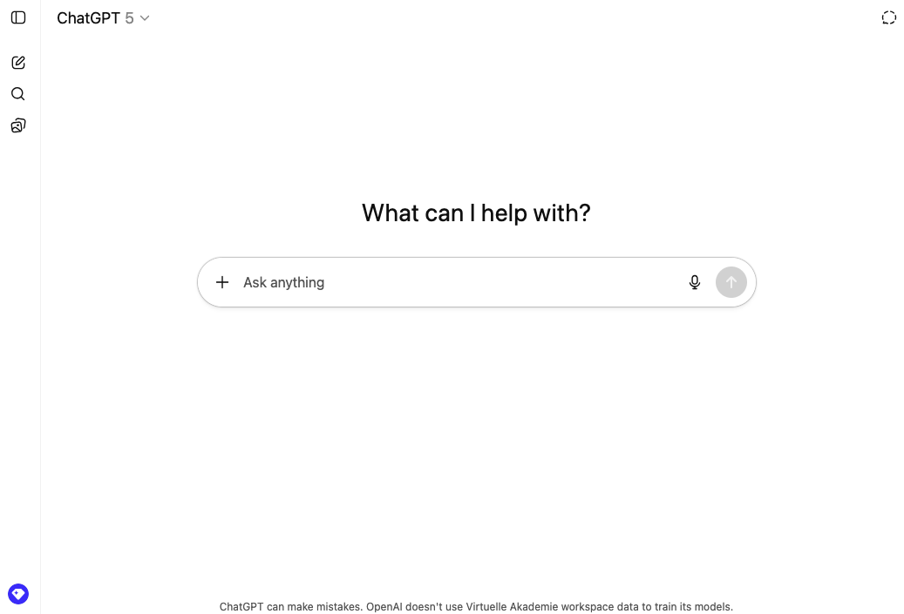

## Was sind Chatbots?

:::: {.columns}
::: {.column width="30%"}

:::

::: {.column width="70%"}

:::
::::

## Was sind LLMs?

:::: {.columns}
::: {.column width="60%"}
Ein LLM kann man sich wie einen ausgefeilten Autocomplete-Mechanismus vorstellen.
:::
::: {.column width="40%"}

:::
::::

## Was sind LLMs?

- Statistische Modelle, die Text analysieren, um das nächste Wort vorherzusagen.

::: {.hidden}
$$
\newcommand{\green}[1]{\color{green}{#1}}
\newcommand{\purple}[1]{\color{purple}{#1}}
\newcommand{\red}[1]{\color{red}{#1}}
\newcommand{\blue}[1]{\color{blue}{#1}}
$$
:::

$$\green{P(\text{Wort}_{i+1}} \mid \red{\text{Kontext}}, \blue{\text{Modell}})$$

- Jede $\purple{\text{Vorhersage}}$ basiert auf dem $\blue{\text{Kontext}}$ und dem internen $\red{\text{Modell}}$.

## Vorhersage

Nicht alle Teile des Kontexts sind gleich wichtig:

 

:::{.r-fit-text}
_"Die Familie, die sehr wohlhabend war, lebte in einem grossen Haus. Das Haus stand inmitten eines weitläufigen Gartens. Es war bekannt für seine prächtige Fassade und die grosszügigen ___"_
:::

 

Welche Wörter sind besonders wichtig, um

- die Bedeutung des Satzes zu erfassen?
- das nächste Wort vorherzusagen?

## Wie generieren LLMs Text?

 

::: {.hidden}
$$
\newcommand{\green}[1]{\color{green}{#1}}
\newcommand{\purple}[1]{\color{purple}{#1}}
\newcommand{\red}[1]{\color{red}{#1}}
\newcommand{\blue}[1]{\color{blue}{#1}}
$$
:::

$$\green{P(\text{Wort}_{i+1}} \mid \red{\text{Kontext}}, \blue{\text{Modell}})$$

## Wie werden LLMs trainiert?

## Gefahren und Herausforderungen

:::: {.columns}
::: {.column width="50%"}
:::{.r-fit-text}
Die verschiedenen Stufen des Trainings sind mit verschiedenen Arten von Bedenken verbunden:

- **Urheberrecht**: Die trainierten Modelle werden mit Texten trainiert, die möglicherweise urheberrechtlich geschützt sind.
- **Bias**: Die trainierten Modelle können bestehende Vorurteile aus den Trainingsdaten lernen.
- **Energieverbrauch**: Das Training der Modelle verbraucht viel Energie.
- **Sycophancy**: Die Modelle neigen dazu, die Meinungen ihrer Benutzer zu bestätigen.
:::

:::
::: {.column width="50%"}

:::
::::

## Gefahren und Herausforderungen

:::: {.columns}
::: {.column width="50%"}
:::{.r-fit-text}
- Obschon sich LLMs viel Wissen aneignen, werden sie nicht trainiert, faktisch korrekte Aussagen zu machen.
- Dies bedeutet, dass wir alle Aussagen, die LLMs uns präsentieren, immer kritisch hinterfragen müssen.
- LLMs sind **keine Wissensdatenbanken**. Informationen immer anhand externer Quellen überprüfen.
:::
:::
::: {.column width="50%"}

:::
::::

## ChatGPT

## Fragen beantworten

## Bilder analysieren

## Dokumente zusammenfassen

## Output strukturieren

## Websuche

## Datenanalyse

## Custom GPTs

## Chain-of-Thought "Denken"

Explizites Nachdenken verbessert die Ergebnisse:

- "Denke Schritt für Schritt"
- Der Chatbot zeigt seinen "Denkprozess"
- Besonders hilfreich bei komplexen Aufgaben

## Vergleich

Beispiel-Aufgabe: "Was ist grösser: 9.11 oder 9.8?"

**Ohne Anleitung**: Oft falsch (verwechselt mit Datumsformat)

**Mit "Denke Schritt für Schritt"**: Meist richtig (vergleicht Dezimalzahlen korrekt)

## Wichtige Einsicht

::: {.key-point}
## Kernaussage

Sprachmodelle **verstehen** nicht. Sie berechnen statistische Wahrscheinlichkeiten.

Chatbots sind keine reinen Textgeneratoren mehr. Sie sind Werkzeuge, die verschiedene Aufgaben ausführen können.
:::

## Zusammenfassung

Was wir gelernt haben:

- **Textgenerierung** = statistische Vorhersage
- **Tool-Nutzung** = erweiterte Fähigkeiten
- **"Denken"** = verbesserte Ergebnisse durch explizite Schritte
